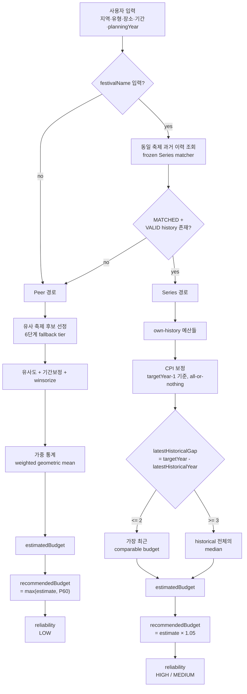

# 축제 예산 계획 어시스트 — 최종 예산 추정 알고리즘

이 문서는 다년도(2017–2026) 데이터를 사용하는 **Planning Budget Assistant**(`/api/v1/multiyear-budget-estimates`, model `MULTIYEAR_PLANNING_V1`)가 현재 production에서 실제로 어떻게 예산을 계산하는지 설명한다. "Phase 1부터 무엇을 시도했는가"를 시간순으로 나열하는 개발일지가 아니라, **지금 이 순간 production이 어떻게 동작하는가**를 설명하는 참조 문서다. 개발 과정에서 있었던 단계별(Phase) 실험/검증은 이 저장소의 커밋 history에는 남아 있지 않다 — 이 문서 자체가 그 결론을 production 코드와 대조해 정리한 최종본이며, 여기 없는 근거를 별도 파일에서 찾을 필요가 없도록 독립적으로 읽히게 작성했다.

독자: 개발자, 데이터 담당자, 평가자, 이후 알고리즘을 유지보수할 담당자.

## 1. 목적

**이 시스템은 축제의 실제 집행액(actual expenditure)을 예측하는 모델이 아니다.** 사용자가 아직 열리지 않은 미래 지역축제의 예산을 계획할 때 참고할 수 있는 **계획 예산(planned budget)을 추정·추천**하는 시스템이다.

기반 데이터 자체도 실제 집행 실적이 아니라 문화체육관광부 등이 공개한 **지역축제 개최 계획 자료**(연도별 계획예산 신고 데이터)에서 온다. 따라서 이 알고리즘의 산출물을 "actual expenditure prediction"이나 "실제 집행 예측"으로 표현하지 않는다 — 어디까지나 "과거 계획예산 데이터를 참고한, 다음 계획을 위한 제안"이다.

## 2. 데이터 범위

현재 canonical multiyear dataset(`MultiYearFestivalRecord`, DB 실측 재확인):

| 연도 | 건수 |
| --- | --- |
| 2017 | 733 |
| 2018 | 886 |
| 2019 | 884 |
| 2020 | 968 |
| 2021 | 1,004 |
| 2022 | 944 |
| 2023 | 1,129 |
| 2024 | 1,170 |
| 2025 | 1,214 |
| 2026 | 1,266 |
| **합계** | **10,198** |

budget quality(`budgetQualityFlag`):

| 값 | 건수 | 의미 |
| --- | --- | --- |
| VALID | 9,930 | 학습/추정에 사용 가능 |
| MISSING_OR_NONPOSITIVE | 258 | 예산 값이 없거나 0 이하 — 학습 pool에서 제외 |
| UNIT_SCALE_SUSPECT | 10 | 단위 오염 의심(예: 자릿수 오류) — 학습 pool에서 제외 |

VALID이 아닌 레코드는 training pool 구성 단계(`buildTrainingPool`/`filterReferencePool`)에서 항상 제외되며, region/festivalType이 없는 레코드도 함께 제외된다.

## 3. Leakage-safe 원칙

planning year `Y`에 대한 추정은 `reference.datasetYear < Y`인 레코드만 참조한다 — 미래 데이터(자기 자신이 속한 연도 포함)는 절대 참조하지 않는다.

| planning year | 참조 가능 연도 |
| --- | --- |
| 2024 평가 | 2017–2023 |
| 2025 평가 | 2017–2024 |
| 2026 평가 | 2017–2025 |
| 2027 실제 계획 | 2017–2026 |

Series own-history(동일 축제 과거 예산) 역시 완전히 동일한 규칙을 따른다 — `computeOwnHistorySignal`이 group member 중 `datasetYear < targetYear`인 것만 historical로 취급한다.

이 정책은 **validation(backtest)과 production 모두 동일**하다 — leakage-safe backtest에서 측정한 정확도가 production에서 재현되지 않을 이유가 없다는 것이 이 원칙의 핵심 목적이다. 단 `referenceDataPolicy=INCLUDE_PUBLISHED_SAME_YEAR`(계획이 이미 공개 확정된 당해 연도 데이터까지 참조 허용)를 요청하면 `referenceYearTo=planningYear`까지 확장될 수 있다 — 이 경우도 Series own-history는 별도로 `datasetYear < planningYear` 규칙을 그대로 강제한다(§18의 seriesSignal 참고).

## 4. 전체 계산 구조



Series 경로가 선택되면 Peer 통계(P25/P50/P60/P75/sampleCount/dataQualityV3 등)는 여전히 함께 계산되어 응답에 포함되지만(§13, §16 참고), estimatedBudget/recommendedBudget 자체는 Series 값으로 대체된다.

## 5. Series estimator

동일 축제 판별은 **frozen Series matcher**(`lib/multiyear-series/series-linker.ts`+`series-lookup.ts`)가 담당하며, 이 문서의 범위에서 matcher 자체의 내부 규칙(정규화/유사명 매칭 threshold 등)은 변경하지 않는다 — 이번 Phase는 물론 최근 여러 Phase에 걸쳐 matcher는 고정으로 취급됐다.

**G0(gap-aware estimator, 현재 production)** — 계산 흐름(`lib/multiyear-series/own-history.ts`의 `computeOwnHistorySignal`):

1. matched group의 member 중 `datasetYear < targetYear`(과거만)인 것만 historical로 취급.
2. 각 historical budget을 CPI로 planning year 기준 가격으로 환산(§6 참고, all-or-nothing fallback — §7).
3. `latestHistoricalGap = targetYear - latestHistoricalYear`를 계산한다.
4. **`latestHistoricalGap <= 2`면 가장 최근 comparable budget(LATEST)**을, **`latestHistoricalGap >= 3`이면 historical 전체의 median(MEDIAN)**을 `estimatedBudgetKrw`로 쓴다.

```
latestHistoricalGap <= 2  →  가장 최근 유효 계획예산(LATEST)
latestHistoricalGap >= 3  →  동일 축제 과거 예산 전체의 median(MEDIAN)
```

threshold(`GAP_THRESHOLD_FOR_LATEST=2`)는 leakage-safe backtest(n≈2242, 2024~2026 fold)로 확정된 값이며, 이 문서 갱신 시점에도 재튜닝하지 않았다. **실측(2024~2026 backtest)상 LATEST가 Series 표본의 90.3%를 차지한다** — LATEST는 "특별 보정"이 아니라 Series 방식의 정상적인 다수 경로다(§17/tester wording 참고).

MEDIAN 분기(`latestHistoricalGap >= 3`)는 G0 이전과 계산 자체가 동일하다 — Peer와 달리 Series는 후보 가중치라는 개념이 없다(Phase 9A-Safety: median이 large-underprediction 개선을 상당 부분 유지하면서 catastrophic tail을 가장 안정적으로 억제한다는 결론에 따라 고정됨. actual budget 크기에 따라 median/geometric mean 등을 바꿔 쓰는 라우팅은 하지 않는다 — 추정 시점에는 실제 값(actual)을 알 수 없어 그런 라우팅 자체가 성립하지 않는다). isolated-spike guard(단발성 이상치 방어) 같은 추가 heuristic은 의도적으로 넣지 않았다 — false protection이 더 크다는 결론으로 REJECT됐다.

LATEST 분기의 CPI 처리는 MEDIAN과 완전히 동일한 all-or-nothing 규칙을 공유한다 — LATEST만 별도로 CPI 가용성을 판단하지 않는다(§7).

CPI 보정 공식(source year `s`, planning year `Y`):

```
adjustedBudget = sourceBudget × CPI[Y-1] / CPI[s]
```

`Y` 자신의 CPI가 아니라 `Y-1`(target 기준 가장 최근 확정 물가 수준)을 쓴다 — target의 아직 존재하지 않는 미래 가격 수준을 참조하지 않기 위함이다.

현재 CPI table(`lib/multiyear-series/cpi.ts`, `CPI_TABLE`):

| 연도 | CPI |
| --- | --- |
| 2017 | 97.645 |
| 2018 | 99.086 |
| 2019 | 99.466 |
| 2020 | 100.0 |
| 2021 | 102.5 |
| 2022 | 107.72 |
| 2023 | 111.59 |
| 2024 | 114.18 |
| 2025 | 116.61 |

이 값은 source에서 그대로 가져온 것이며, 실제 값이 이 문서와 다르면 **항상 production source(`lib/multiyear-series/cpi.ts`)가 우선**한다.

## 6. 왜 CPI는 Series에만 쓰는가

leakage-safe하게 실측해 확정한 정책이며(CPI production 반영은 `a6defed`에 포함), 이 문서 작성 시점에 production source 기준으로 재확인했다.

- **Series**: CPI 적용 시 MdAPE가 일관되게 개선됐고(약 18.1%→16.3% 수준), 개선폭이 오래된 데이터일수록 커지는(source age가 클수록 CPI 보정 효과가 커지는) 경제적으로 타당한 패턴까지 확인됐다. 3개 fold(2024/2025/2026) 전부 같은 방향으로 안정적이었다 → **채택**.
- **Peer**: CPI 적용 시 오히려 fold별로 불안정하고, 표본이 가장 큰 소액 구간에서 악화가 관측됐다 → **미적용**.
- **Recency weighting**(최근 데이터에 더 큰 가중치)도 함께 검토했으나, Peer fallback의 source age와 오차 사이 상관이 사실상 0이고 fold마다 부호가 뒤집혀 **미적용**.

이것은 "아직 구현하지 못했다"가 아니라, **실측 후 의도적으로 채택하지 않은 정책**이다. 향후 공식 CPI 데이터 소스가 새로 도입되더라도 이 결론(Series에는 유효, Peer에는 무효)이 재현될 가능성이 높다고 평가됐다.

## 7. Series CPI fallback

`tryAdjustForCpi`가 필요한 두 연도(`sourceYear`, `planningYear-1`) 중 하나라도 `CPI_TABLE`에 없으면(예: `planningYear >= 2027`) `null`을 반환한다. 이때 **해당 target의 historical 예산 전체가 nominal(CPI 미보정) median으로 fallback**한다 — 일부는 CPI 보정된 값, 일부는 nominal 값을 섞어 median을 계산하지 않는다(`own-history.ts`의 `cpiFullyAvailable` 체크가 "전부 가능"이 아니면 즉시 전체를 nominal로 되돌린다).

부분 혼합을 하지 않는 이유: 서로 다른 기준 시점(일부는 물가 보정됨, 일부는 안 됨)의 값을 한 분포에 섞으면 median 자체의 의미가 불분명해지고, 어떤 연도 조합이 fallback을 유발했는지에 따라 결과가 미묘하게 달라지는 예측 불가능한 동작이 생긴다. "전부 보정 아니면 전부 nominal"이 가장 단순하고 설명 가능한 규칙이다.

### 7.1 Future-year semantics

보유 canonical dataset은 2026까지다. `planningYear`가 그보다 미래(2027 이상)여도 알고리즘은 새 데이터를 만들거나 보간하지 않는다 — 항상 실제 존재하는 과거 데이터만 쓴다.

```
planningYear = Y
→ datasetYear < Y인 record만 참조(§3 leakage-safe 원칙 그대로, 미래로 확장해도 예외 없음)

latestHistoricalGap <= 2  → LATEST
latestHistoricalGap >= 3  → MEDIAN

CPI_TABLE에 필요한 연도가 없으면(예: planningYear >= 2027, CPI_TABLE은 2025까지만 지원)
→ 해당 Series 전체 nominal fallback(§7, LATEST/MEDIAN 두 분기 모두 동일 규칙)
```

예시(동일 축제, `latestHistoricalYear=2026`인 경우 — 실제 부산국제록페스티벌로 leakage-safe backtest 재현 완료):

| planningYear | gap | 분기 | CPI |
| --- | --- | --- | --- |
| 2027 | 1 | LATEST | nominal fallback(CPI[2026] 없음) |
| 2028 | 2 | LATEST | nominal fallback(CPI[2027] 없음) |
| 2029 | 3 | MEDIAN | nominal fallback(CPI[2028] 없음) |
| 2030 | 4 | MEDIAN | nominal fallback(CPI[2029] 없음) |

recommendation(`estimate × 1.05`)과 reliability(§17) 계산 방식도 미래 planningYear라고 해서 달라지지 않는다 — "미래라서 추가 buffer를 더 얹는다"거나 "미래라서 fallback 정책이 바뀐다" 같은 특수 처리는 없다. reliability의 leakage-safe calibration threshold(§17)는 실제 보유 데이터(2018~2026 fold)로 saturate되므로, planningYear가 아무리 먼 미래여도(예: 2035) 계산이 항상 가능하다(calibration pool 부족으로 threshold를 못 구하면 HIGH로 안전하게 fallback — 이 fallback 방향도 이번 문서 갱신에서 바꾸지 않았다).

## 8. Peer estimator

Series signal을 쓸 수 없을 때(§18의 UNMATCHED/AMBIGUOUS/NO_VALID_HISTORY/NOT_REQUESTED) Peer fallback으로 추정한다.

similarity 가중치(합 = 1.0, `lib/services/algorithm-config.ts`):

| feature | weight |
| --- | --- |
| Type(축제 유형) | 0.40 |
| Region(지역) | 0.25 |
| Venue(장소 유형) | 0.20 |
| Duration(개최기간) | 0.15 |

세부 점수:

- **Type**: 겹침(overlap) = 1.00, 다름 = 0.10
- **Region**: 같은 시군구 = 1.00, 같은 광역시도 = 0.80, 그 외 = 0.30
- **Venue**: 동일 = 1.00, 한쪽이 미정(UNDECIDED) = 0.45, 다름 = 0.25
- **Duration**: `exp(-abs(log((targetDays+1)/(sourceDays+1))))`

Venue/Duration은 query 또는 후보 어느 한쪽이라도 값이 없으면(missing) 그 feature를 점수 계산에 참여시키지 않고, **가중치 자체를 분모/분자에서 제외한 뒤 나머지 feature 가중치로 재정규화(renormalize)**한다:

```
similarity = Σ(featureScore × weight, 두 쪽 다 값 있는 feature만) / Σ(weight, 같은 조건)
```

Type/Region은 후보 pool 진입 조건상 항상 값이 있어 이 재정규화 대상이 아니다. 사용자가 제시한 "missing=.35" 고정 페널티는 **이 renormalize 방식과는 다른 레거시 S0(`candidate-selector.ts`) 전용 계산**에서만 쓰이며, Planning API가 실제로 쓰는 V1 경로(`computeMultiYearSimilarity`, `similarity-calculator.ts`)는 고정 페널티가 아니라 위 재정규화를 쓴다 — 이 문서는 Planning API가 실제로 쓰는 경로를 기준으로 서술한다.

## 9. Duration budget adjustment

후보의 원 예산을 요청한 개최일수 기준으로 보정한다(`lib/services/duration-adjuster.ts`):

```
adjustedBudget = sourceBudget × clamp(targetDays / sourceDays, 0.5, 2.0) ^ 0.55
```

`0.55`(duration elasticity)는 임의로 고른 값이 아니라 기존 empirical duration-elasticity 실험 결과이며, 이후 여러 Phase(12B/22A/23/24/25)에서 반복적으로 재검증되면서도 값 자체는 바뀌지 않고 유지됐다.

단, Phase 23(duration monotonicity deep audit)에서 **elasticity 함수 자체는 monotonicity violation의 원인이 아님**이 확인됐다 — elasticity만 바꿔 counterfactual을 돌려본 결과 violation 재현율이 0.00%였다. violation의 실제 원인은 §26.2에서 설명한다.

candidate의 `durationDays`가 없으면(null) 이 보정 없이 원 예산을 그대로 쓴다.

## 10. Candidate selection / fallback

Planning API(V1)가 쓰는 selector는 `selectMultiYearCandidatesV1`(`lib/multiyear/candidate-selector-v1.ts`)이며, 6단계 fallback tier를 순서대로 넓혀가며 후보를 누적한다:

1. `SAME_DISTRICT_TYPE_VENUE` — 같은 시군구 + 같은 유형 + 같은 장소유형
2. `SAME_REGION_TYPE_VENUE` — 같은 광역시도 + 같은 유형 + 같은 장소유형
3. `NATIONWIDE_TYPE_VENUE` — 전국 + 같은 유형 + 같은 장소유형
4. `SAME_REGION_TYPE` — 같은 광역시도 + 같은 유형
5. `NATIONWIDE_TYPE` — 전국 + 같은 유형
6. `GLOBAL_SIMILARITY` — 전체(유형 제한 없음)

기준(`algorithmConfig`, source 확인 완료):

- `minSampleCount = 8`
- `recommendedSampleCount = 20`
- `maxSampleCount = 50`
- `similarityMinThreshold = 0.35`(최종 채점 단계에서 이 미만은 제외)

각 tier가 끝날 때마다 누적 표본이 `recommendedSampleCount` 이상이고 **연도 쏠림(concentration)** 이 기준(`YEAR_CONCENTRATION_CAP=0.5` — 특정 연도 하나가 누적 weight의 50%를 넘지 않음) 이내면 그 tier에서 멈춘다. 표본은 충분한데 연도 쏠림이 기준을 넘으면 **quality gate**가 발동해, 그 시점까지의 최고 유사도 대비 `QUALITY_LOSS_BUDGET=0.05`(5%p) 이내인 후보만 더 넓은 tier에서 추가로 받아들인다 — 단순히 연도 다양성을 채우기 위해 유사도가 크게 떨어지는 후보를 넣지 않는다. 이 두 상수는 Spring 시절 9개 조합 sensitivity 실험에서 이미 확정된 값으로, 이 프로젝트에서 다시 튜닝하지 않는다.

## 11. Deterministic candidate ordering

Phase 28(진단)/29(fix, commit `a477856`)에서 발견·수정된 reproducibility 문제다.

**기존 문제**: 최종 상위 N건(`maxSampleCount=50`) 컷은 `score.weight` 내림차순 정렬 후 자르는 방식인데, weight가 **정확히 같은(exact tie)** 후보끼리는 JS의 stable sort 성질상 "입력 배열에 들어온 순서"가 그대로 유지됐다. 그런데 그 입력 배열 순서는 DB `orderBy: {id: "asc"}`(reimport마다 재발급되는 autoincrement)에서 왔다 — 논리적으로 완전히 동일한 데이터를 다시 적재하기만 해도 tie 근처에서 어떤 후보가 top-50에 들어가는지가 달라질 수 있었다.

**최종 규칙**:

```
primary   = score.weight DESC
secondary(정확히 동률일 때만) = sourceSha256 + sourceSheet + sourceRow(6자리 zero-pad)
```

이 secondary key는 원본 엑셀 파일의 해시+시트명+행번호로만 구성되며, budget/duration/최신연도 등 "모델링 의미"를 담은 필드는 의도적으로 쓰지 않는다 — **이 tie-break는 정확도를 높이기 위한 feature가 아니라, 재현성(reproducibility)을 보장하기 위한 규칙**이다.

이 fix가 필요했던 이유의 크기: Phase 28 실측 결과 Peer target의 **82.94%**가 top-50 cutoff 경계에서 tie의 영향을 받을 수 있었다(cutoff tie 그룹 평균 크기 88.7개 후보). 이 fix 이후 5개의 서로 다른 input 순서(원본/역순/셔플 등)에서 mismatch 0건이 확인됐다.

## 12. Peer statistics

최종 상위 N건 후보에 대해(`computeCoreStats`, `lib/multiyear/baseline-estimator.ts`):

- **가중치**: `weight = similarity²`(similarity 자체가 아니라 제곱값을 통계 가중치로 씀 — 유사도가 낮은 후보의 영향력을 더 빠르게 줄인다)
- **winsorize**: 후보 예산(기간보정 후)의 로그값을, 같은 festivalType과 겹치는 training pool 전체 분포의 P5~P95 로그 구간으로 clip. (모집단은 최종 선정된 후보군이 아니라 그보다 넓은 "같은 유형의 전체 training pool"이다.)
- **weighted arithmetic mean** → `weightedAverageBudgetKrw`(참고용 표시 필드)
- **weighted geometric mean** → **`estimatedBudgetKrw`(최종 point estimate)**
- **P25 / P50 / P60 / P75**(가중 quantile) → `p25Krw`/`p50Krw`/`p60Krw`(recommendation에 사용, §15)/`p75Krw`

최종 point estimate는 **가중 산술평균이 아니라 가중 기하평균**이다 — 예산처럼 오른쪽 꼬리가 긴(right-skewed) 분포에서 극단값의 영향을 줄이기 위함이다.

## 13. 예상 예산 vs 추천 계획 예산

이 문서에서 가장 자주 혼동되는 두 필드를 명확히 구분한다.

| 필드 | 의미 |
| --- | --- |
| `estimatedBudgetKrw`(예상 예산) | 데이터 기반의 중심 추정치(point estimate) — Series면 CPI 보정 median, Peer면 가중 기하평균 |
| `recommendedBudgetKrw`(추천 계획 예산) | 계획 단계에서 실제로 참고할, **의도적으로 보수적으로 조정한** 예산 제안 |

둘은 서로 다른 값이며, 같은 의미로 섞어 쓰지 않는다. `recommendedBudgetKrw`는 항상 `estimatedBudgetKrw` 이상이 되도록 설계돼 있다(§14, §15).

## 14. Series recommendation

```
recommendedBudgetKrw = round(estimatedBudgetKrw × 1.05)
```

고정 +5% buffer(`SERIES_PLANNING_BUFFER_RATE`, `lib/multiyear-series/apply-planning-semantics.ts`)다. reliability tier(HIGH/MEDIUM)나 legacy confidence/dataQualityV3에 따라 이 비율이 달라지지 않는다 — 모든 SERIES_APPLIED 대상에 예외 없이 동일하게 적용된다. **legacy confidence 기반 contingency는 없다.**

## 15. Peer recommendation

```
recommendedBudgetKrw = max(estimatedBudgetKrw, P60)
```

(`computeFinalPeerRecommendation`, `lib/multiyear/final-recommendation.ts`). 함수 시그니처 자체에 confidence/dataQuality 인자가 없다 — 구조적으로 legacy confidence가 개입할 수 없다. **추가 contingency(예비비) 없음.**

## 16. P25–P75 reference range

**P25–P75는 선택된 유사 축제들의 경험적 예산 분포를 보여주는 참고 범위다.**

다음처럼 표현하지 않는다:

- confidence interval(신뢰구간)
- prediction interval(예측구간)
- 50% probability interval(50% 확률 구간)

Series 경로에서도 응답의 `p25Krw`/`p75Krw`는 **Series 자체가 아니라 항상 Peer(유사 축제) 분포에서 계산된 값**이다(`rangeBasis`는 Series/Peer 여부와 무관하게 항상 `PEER_EMPIRICAL_P25_P75`) — Series own-history의 P25/P75(historyCount가 작을 때 폭이 좁아 실제 값을 덜 포함)는 별도로 계산은 되지만 public range로 채택되지 않았다.

## 17. Reliability

사용자에게는 숫자 confidence가 아니라 3단계 tier(`reliabilityTier`)만 노출한다: **HIGH / MEDIUM / LOW**.

- **HIGH**: Series 이력 기반이며, 현재 volatility 판정 규칙에서 "안정적"으로 분류된 계열.
- **MEDIUM**: Series 이력은 있으나(2건 이상) 연도별 변동성이 상대적으로 큰 계열.
- **LOW**: 자체 과거 이력 대신 Peer fallback을 사용.

내부적으로 tier는 `tierFromVolatility`(`lib/multiyear-series/reliability.ts`)가 결정한다 — historyCount≤1이면 무조건 HIGH(변동성 계산 불가), 그 외에는 CPI 보정 historical 예산의 `log(P75/P25)`(volatility)가 leakage-safe threshold 이하면 HIGH, 초과하면 MEDIUM이다. 이 threshold는 하드코딩된 상수가 아니라 매 planning year마다 과거 backtest 데이터로 다시 계산되는 leakage-safe median이다(`computeLeakageSafeVolatilityThreshold`, `runtime-cache.ts`가 캐싱).

**G0 도입 이후 재검증 결과(§24)**: HIGH/MEDIUM의 **실측 정확도(MdAPE)는 서로 비슷해졌다**(HIGH 9.28% vs MEDIUM 10.00%, G0 이전에는 10.66% vs 21.19%로 훨씬 크게 벌어져 있었다). 그러나 **historical dispersion(변동성) 자체는 여전히 명확하게 다르다** — dispersion median이 HIGH 0.0474, MEDIUM 0.2303으로 약 5배 차이난다. 즉 tier가 "정확도 등급"으로 잘못 읽힐 위험은 G0 이전보다 오히려 커졌지만(정확도만 보면 거의 구분이 안 되므로), tier가 담고 있는 "과거 데이터 근거의 안정성" 정보 자체는 여전히 유효하다 — 그래서 아래 문구가 이전보다 더 중요하다:

> 신뢰도는 예산이 맞을 확률이 아니라, 이 추정에 사용한 데이터 근거의 안정성/강도를 나타낸다.

## 18. historyCount=1 설명

**아래는 현재 production(commit `a6defed`)을 기준으로 서술하며, 이 문서 자체가 항상 최신 source of truth다.**

`historyCount<=1`이고 tier=HIGH인 경우, 애초에 "연도별 변동"을 측정할 수 없다(비교할 과거 값이 1개뿐이므로 volatility 자체가 정의되지 않는다). 따라서 reason 문구를 historyCount로 분리한다(`PlanningReliabilityReasonKey`):

- **historyCount ≤ 1 + HIGH**(`SERIES_STABLE_SINGLE_HISTORY`):
  > 동일 축제의 과거 예산 이력을 활용해 예산을 추정했습니다.
- **historyCount ≥ 2 + HIGH(안정적)**(`SERIES_STABLE`):
  > 동일 축제의 과거 예산 이력을 활용했고, 물가 보정 후 연도별 예산 변동이 비교적 안정적입니다.

즉 history가 1개뿐인 경우 "연도별 변동이 안정적"이라고 **설명하지 않는다** — 측정 자체가 불가능했던 것을 "측정해봤더니 안정적이었다"처럼 표현하면 근거를 과장하게 되기 때문이다(Phase 20에서 최초 발견, Phase 30에서 재확인 — HIGH tier 1,200건 중 571건(47.58%)이 이 케이스였다. Phase 31-B가 이 문구만 분리 수정했다 — tier 산정 자체는 변경되지 않았다).

**G0 이후 재검증(중요)**: `SERIES_STABLE_SINGLE_HISTORY` cohort(HIGH의 47.6%, n=571)의 실측 MdAPE는 **10.81%로, MEDIUM(10.00%)보다도 나쁘다** — 반면 실제로 다년간 이력이 있어 변동성을 측정한 `SERIES_STABLE` cohort(n=629)는 7.93%로 가장 정확하다. 즉 **"HIGH라고 해서 반드시 여러 해의 안정성이 검증된 것은 아니다"** — HIGH 태그 하나로 두 성격이 다른 cohort(측정된 안정성 vs 측정 불가로 인한 기본값)가 섞여 있다는 사실을 tester/handoff 문서 모두에서 명확히 알린다. tier 로직 자체는 이 문서 갱신에서도 변경하지 않았다.

MEDIUM(`SERIES_VOLATILE`)과 LOW(`PEER_FALLBACK`) 문구는 이번 수정과 무관하게 그대로다:

- MEDIUM: "동일 축제의 과거 예산 이력을 활용했지만, 물가 보정 후 연도별 예산 변동폭이 큰 편입니다."
- LOW: "동일 축제의 충분한 과거 예산 이력을 확인하지 못해 유사 축제 데이터를 기반으로 추정했습니다."

### 18.1 Data Quality Audit — Reliability와는 별개 axis

Series 결과에 대해 **read-only diagnostic**으로 Data Quality Audit(`lib/multiyear-series/data-quality-audit.ts`)이 함께 제공된다. estimator/reliability 어느 쪽 계산에도 관여하지 않으며, 값을 자동 수정하거나 계산에서 자동 제외하지 않는다.

```
Reliability          → historical evidence/stability(§17) - "이 데이터가 연도별로 얼마나 흔들렸는가"
Data Quality Audit   → source-value review signal - "이 개별 record 값이 Series 문맥에서 검토할 가치가 있는가"
```

두 개념은 **자동으로 연결되지 않는다**:

- **Audit HIGH ≠ Reliability LOW** — 둘 다 실측으로 독립성이 확인됐다(같은 point-estimate source record가 reliability=HIGH이면서 audit=HIGH인 경우가 실제로 존재한다 — 예: 해운대모래축제 2025 backtest 사례, reliability는 HIGH였지만 point-estimate source가 audit MEDIUM이라 실제로 크게 틀렸다).
- **Audit signal ≠ 자동 제외** — REVIEW_REQUIRED일 뿐 DATA_ERROR_CONFIRMED가 아니다. 값은 그대로 계산에 쓰인다.
- **Audit signal ≠ 자동 보정** — audit이 값을 바꾸지 않는다.

**audit 범위는 "Series에 연결된 VALID budget records"**로 한정된다 — own-history eligibility(VALID budget + region/유형 존재)를 통과해 실제로 어떤 Series 그룹에 연결된 record만 대상이며, "전체 축제 데이터"나 "canonical dataset 전체"가 아니다. 실측(2024~2026 backtest): reliability=HIGH cohort는 point-estimate source에 audit signal이 있는 경우가 0.75%(9/1200)에 불과하지만, MEDIUM cohort는 8.54%(89/1042)로 훨씬 흔하다 — MEDIAN 분기가 eligible record 전체를 point-estimate source로 쓰기 때문에(LATEST는 record 1건만) 노출 표면이 넓어지는 구조적 차이다.

## 19. Legacy confidence

과거(레거시 단일연도 S0 알고리즘, `predictForQueryLegacy2026`) 시절 numeric confidence(0~100)와 `dataQualityV3` 지표가 존재했고 지금도 필드/계산 자체는 내부적으로 남아 있다. 다만:

- **final recommendation driver 아님** — Planning V1의 `recommendedBudgetKrw`는 §14/§15의 고정 공식만 쓰고, `computeFinalPeerRecommendation`은 confidence 인자를 아예 받지 않는다.
- **final reliability driver 아님** — §17의 tier는 CPI-adjusted volatility만으로 결정되며 legacy confidence를 전혀 참조하지 않는다.
- **final API user-facing numeric confidence 아님** — API 응답에 숫자 confidence 필드 자체가 없다.

`dataQualityV3`는 호환성을 위해 응답에 남아 있는 필드이며, 소스 코드 주석 자체에 "PHASE 19-A부터 recommendation 계산에 쓰이지 않는다"고 명시돼 있다 — 표시용으로 쓰려면 §17의 `reliabilityTier`/`reliabilityReason`과 절대 섞지 않는다.

## 20. Duration data correction

2022–2024 `durationDays` 전량 결측이 발견되어 원인을 규명·복구했다(commit `a477856`, `scripts/multiyear-import/duration-recovery.ts` + `docs/multiyear-duration-recovery.md` 참고).

**원인**: 원본 소스 데이터의 한계가 아니라 **canonical 생성/파싱 과정의 버그(parsing failure)** 였다 — 2024 duration이 원래부터 존재하지 않았던 "source limitation"이 아니라, 존재했지만 canonical 변환 단계에서 누락된 "복구 가능한 결측"이었다.

SAFE recovery 결과(결정론적 텍스트 분류 규칙 적용, 원본 텍스트에 명시적 기간 정보가 있는 경우만 복구):

| 연도 | 복구 건수 |
| --- | --- |
| 2022 | 392 |
| 2023 | 539 |
| 2024 | 549 |
| **합계** | **1,480** |

검증: 이미 duration이 정상이던 2017–2021 데이터를 기준으로 한 golden parity 재현 결과 **0/3,025 mismatch**, canonical CSV ↔ DB 간 재적재 후 대조도 **mismatch=0**을 확인했다.

## 21. Venue limitation

Phase 26에서 확인된 2017–2024 `venueType`(장소 유형) 정보 부재는 §20의 duration과는 성격이 다르다 — **pipeline mapping failure가 아니라 원본 소스 자체의 한계**다. 원본 엑셀 파일 자체에 해당 컬럼이 없거나(2017–2024) 기재되지 않았고, schema/canonical 생성 코드에도 이를 뒷받침하는 주석이 있다. safe-recoverable 건수 = **0**(복구할 원본 텍스트 정보 자체가 없다).

## 22. Visitor

방문객 수(visitor)에 대한 최종 결론(현재 production에는 반영되지 않은 상태이며, 아래는 그 판단 근거다):

- **Series**: visitor feature를 own-history 추정에 추가해도 개선이 없었다(오히려 소폭 악화된 variant도 있었다) → 미채택.
- **Peer**: 후보의 historical visitor를 similarity 계산에 직접 넣는 방식(P1/P2)은 효과가 약했다. 다만 **oracle/proxy 실험**(target 자신의 visitor를 알고 있다고 가정하고 선정된 후보 안에서 scale만 별도 보정하는 방식, P3)에서는 유의미한 개선 가능성이 확인됐다.
- **핵심 제약**: 그 개선 가능성은 **planning-time expected visitor input이 현재 시스템에 없기 때문에** production에 채택하지 못했다 — PEER_FALLBACK 대상은 series 매칭 자체가 안 된 경우라 historical visitor조차 자동으로 확보할 방법이 구조적으로 없다(series 매칭 실패 = visitor 미확보). `visitorTotalPersons`(historical actual visitor record, 과거 실제 방문객 실적)를 `expectedVisitorCount`(future planning-time user input, 계획 시점의 예상 방문객 수 — 현재 production에 없음)와 동일시하지 않는다 — 이 둘은 의미가 다르다.
- **Upper-bound evidence(오해 방지 표현)**: 같은 eligible cohort(n=1,007/1,190) 기준 baseline(P0) MdAPE 68.2% → target visitor를 안다고 가정한 scale calibration(P3) MdAPE 55.3%라는 실측이 있다. 이를 **"visitor를 적용하면 production MdAPE가 55.3%가 된다"로 쓰지 않는다** — genuine planning-time visitor 정보가 확보된다면 Peer의 scale compression(§26.1)을 크게 줄일 가능성이 있다는 **upper-bound evidence**로만 사용한다. 또한 visitor를 similarity 계산에 섞는 방식(P2, 최선 66.1%)보다 **기존 selection은 그대로 두고 별도 scale calibration만 추가하는 방식(P3, 55.3%)이 더 유망**했다 — 향후 이 입력을 실제로 확보하면 P2가 아니라 P3 방향을 우선 검토한다(§28).
- 과거 의심됐던 **"2022년 visitor ×1000 systematic DB bug"**는 재감사(Phase 21-A) 결과 **사실이 아닌 것으로 확인**됐다 — raw 매칭 성공 10,198/10,198건 중 배율(×1000/÷1000) 문제는 0건이었고, 원본 unit 변환은 importer가 정상 처리하고 있었다. 별도로 발견된 5건은 "다른 컬럼(최초개최년도 등)의 값이 방문객 컬럼에 잘못 들어간" 고립된(isolated) 이상치이며, 시스템적 단위 버그가 아니다.
- **historical visitor 극단값**: 분포에는 매우 큰 값(예: 535,558,000)이 존재하나, 위 감사 결과에 따라 시스템적 단위 오류로 단정하지 않는다 — **원본 이상치로 판단되는 극단값**으로만 표현하며, 향후 이 필드를 실사용에 활용할 경우 outlier guard가 필요하다는 참고 사항으로 남긴다.

## 23. Current authoritative benchmark

**⚠ OLD BASELINE(median-fixed Series, G0 이전) — 역사적 기록으로만 남긴다. 현재 알고리즘 성능 비교에 쓰지 않는다:**

| Metric | 값 |
| --- | --- |
| n | 3,432 |
| Overall Estimate MdAPE | 26.49% |
| Series MdAPE | 16.28% |
| Peer MdAPE | 69.04% |
| Overall P90 | 155.34% |
| Overall P95 | 363.06% |

**✅ FINAL G0(현재 production, canonical benchmark) — `scripts/final-production-benchmark.ts` 실제 production 함수 직접 호출, 2024–2026 leakage-safe, 2-pass 실행 SHA-256 hash 완전 일치로 재현성 확인 완료:**

| Group | n | Estimate MdAPE | Recommendation MdAPE | P90 | P95 |
| --- | --- | --- | --- | --- | --- |
| OVERALL | 3,432 | **20.63%** | 20.06% | 153.55% | 355.33% |
| SERIES | 2,242 | **9.59%** | **8.76%** | 50.00% | 75.69% |
| PEER | 1,190 | **69.04%** | 77.74% | 471.06% | 709.75% |

Series 개선폭: Estimate MdAPE **16.28% → 9.59%**(-6.69%p, 약 41% 오차 감소), Recommendation MdAPE **15.33% → 8.76%**(-6.57%p). Peer는 알고리즘이 이 기간 전혀 바뀌지 않아 구조적으로 parity가 보장된다(§10 참고) — 실측 MdAPE(69.04%)와 severe underprediction rate(23.19%, §25)가 이전 기록과 정확히 일치하는 것으로 재확인했다. Overall 개선은 population이 그대로인 상태에서 Series 개선이 그대로 반영된 결과다.

**PEER 그룹(n=1,190)은 old peer benchmark와 알고리즘이 동일하다.** MdAPE가 SERIES보다 훨씬 높은 것은 알고리즘 저하가 아니라 population selection 효과다 — 이 그룹은 "Series로 못 잡히는(매칭 안 되거나 own-history가 없는) 나머지"이므로 원래 더 어려운 subset이 여기 몰린다(§26.1 참고).

과거 기록된 Peer MdAPE 67.62%(Phase 27 시점)는 **deterministic ordering 적용 이전의, DB row-order에 의존하는 우연한 snapshot**이었다 — 같은 논리적 데이터를 다른 순서로 읽으면 67.62%~70.20% 범위에서 다른 값이 나왔다(Phase 28 실측). 이 값은 역사적 기록으로만 남기고, 현재 알고리즘 성능 비교의 baseline으로는 위 69.04%(deterministic, 재현 가능)를 쓴다.

## 24. Reliability latest benchmark

**⚠ OLD BASELINE(G0 이전) — 역사적 기록:**

| Tier | n | 비율 | Estimate MdAPE |
| --- | --- | --- | --- |
| HIGH | 1,200 | 34.97% | 10.66% |
| MEDIUM | 1,042 | 30.36% | 21.19% |
| LOW | 1,190 | 34.67% | 69.04% |

**✅ FINAL G0(현재 production):**

| Tier | n | 비율 | Estimate MdAPE | Recommendation MdAPE |
| --- | --- | --- | --- | --- |
| HIGH | 1,200 | 34.97% | **9.28%** | 8.93% |
| MEDIUM | 1,042 | 30.36% | **10.00%** | 8.47% |
| LOW | 1,190 | 34.67% | 69.04% | 77.74% |

fold별(2024/2025/2026) 전부 **HIGH < MEDIUM < LOW** ordering이 예외 없이 유지된다. 다만 G0 이전(10.66% vs 21.19%, 약 2배 차이)과 달리 **HIGH/MEDIUM의 실측 정확도 차이는 G0 이후 크게 줄었다**(9.28% vs 10.00%) — §17의 "정확도 등급이 아니라 데이터 근거의 안정성 지표" 설명이 이제 더 중요해진 이유다.

## 25. Recommendation benchmark

**⚠ OLD BASELINE(G0 이전):**

| Branch | Recommendation MdAPE |
| --- | --- |
| Series | 15.33% |

**✅ FINAL G0(현재 production):**

| Branch | Recommendation MdAPE | Severe underprediction(recommended<actual×0.7) |
| --- | --- | --- |
| Series | **8.76%** | 10.35% |
| Peer | 77.74% | 23.19% |

**Recommendation은 point prediction 정확도를 최적화한 값이 아니라 planning-conservative policy(항상 estimate 이상으로 보수적으로 제안)다.** Recommendation MdAPE가 estimate MdAPE보다 나쁠 수 있다는 사실 자체가 결함이 아니다 — 단순 accuracy ranking으로 오해해서는 안 된다.

## 26. Known Limitations

### 26.1 Peer scale limitation

자체 이력이 없는 축제는 target의 실제 규모(scale) 정보가 부족한 상태에서 유사 축제만으로 추정한다. 특히 소액 축제의 overprediction, 대형 축제의 underprediction 구조(small-over / large-under)가 아직 남아 있다. Peer의 MdAPE와 tail(P90/P95)은 Series보다 크게 나쁘다(§23).

**Scale compression 실측 증거**(PEER_FALLBACK subset, leakage-safe n=1,190, actual budget quintile 분해):

| Quintile | median actual | median estimate | MdAPE | 방향 |
| --- | --- | --- | --- | --- |
| P0–20 | 30,000,000 | 125,601,680 | 377.9% | overprediction 99.6% |
| P80–100 | 800,000,000 | 252,555,426 | 71.3% | underprediction 99.2% |

actual budget은 quintile 양 끝에서 약 **26.7배**(30M→800M) 벌어지는데, Peer estimate는 같은 구간에서 약 **2배**(125.6M→252.6M)만 움직인다. 이것이 **regression-to-the-middle(scale compression)**의 핵심 실측 증거다 — Peer는 유사 축제들의 예산 분포 중심으로 계속 수렴하려는 경향이 있고, target이 그 분포의 중심에서 얼마나 떨어져 있는지를 구별할 입력 정보가 없다.

**similarity ≠ scale similarity.** Similarity는 "어떤 축제와 비교할 것인가"를 결정하는 신호이지, target 축제가 그 비교군 안에서 어느 규모인지는 충분히 설명하지 못한다. 실측: averageSimilarity vs 실제 target budget의 Spearman 상관 = **-0.032**(사실상 무관), budget quintile별 median averageSimilarity는 **0.935~0.937**로 quintile 전체에서 거의 동일하다 — actual budget scale은 크게 달라지지만 similarity는 거의 변하지 않았다.

**Peer candidate pool 자체의 scale spread**: 동일 target의 finalSample 내부에서도 adjustedBudget의 P90/P10 비율 median = **16.12배**, P75/P25 비율 median = 4.44배에 달한다. 즉 알고리즘이 "유사하다"고 판단한 후보끼리도 실제 계획예산 규모가 매우 넓게 퍼져 있다 — 현재 similarity feature만으로는 target의 scale을 좁히기 어렵다는 직접적인 근거다.

**최종 root cause**: **PLANNING-TIME SCALE INFORMATION SHORTAGE**. region/festivalType/venueType/durationDays는 "비교군"을 정하는 데는 유용하지만, target 자신의 예산 규모를 알려주는 정보가 아니다(§22, §26.7 참고).

Peer는 "아직 완성되지 않은 알고리즘"이 아니다 — **현재 제공 가능한 planning input 안에서 충분히 검증된 baseline**이지만, target의 규모를 직접 식별할 정보가 부족하기 때문에 **정확도 상한이 존재**한다.

### 26.2 Peer input sensitivity(duration monotonicity 포함)

**Peer recommendation은 입력(region/festivalType/venueType/durationDays)이 조금만 바뀌어도 candidate slate 자체가 바뀌며(membership churn), 그 결과 recommendedBudgetKrw가 예상보다 크게 움직일 수 있다.** 이 현상을 처음 발견한 계기는 duration이었지만, 이후 폭넓은 실측(실제 region/type/venue 조합 기반 base case에 대한 feature별 perturbation 연구) 결과 duration은 4개 feature 중 **가장 약한 축**이었다 — 상위 개념을 **Peer Input Sensitivity**로 두고 아래처럼 정리한다.

| feature | median \|Δrecommendation\|(perturbation 시) |
| --- | --- |
| festivalType | 약 55~64% |
| region | 약 29~38% |
| venueType | 약 8~14% |
| duration | 약 7~10% |

즉 duration monotonicity는 중요한 known limitation이지만, **가장 강한 sensitivity 축은 아니다.**

#### Duration monotonicity(최초 발견 사례)

**기간이 증가해도 예상 예산이 항상 증가한다고 보장되지는 않는다.**

Phase 23(deep audit)에서 이 현상의 원인이 duration elasticity(보정 공식) 자체가 아니라, **duration similarity가 candidate ranking/후보 slate 자체를 바꾸는 것**(기간이 조금만 달라져도 top-50 후보 구성이 바뀌는 candidate churn)임이 규명됐다. Phase 24/25에서 duration similarity 제거, 2단계 고정선정+보정 구조, partial weight 조정 등 structural fix를 검토했으나 모두 accuracy/tail trade-off로 미채택됐다(§27 참고) — 현재는 duration similarity weight 0.15를 그대로 유지한다.

#### festivalType sensitivity — 상당 부분 DATA-EXPLAINED

실제 historical population median(VALID budget 기준):

| festivalType | median |
| --- | --- |
| TRADITION_HISTORY | 약 300M |
| CULTURE_ART | 약 280M |
| LOCAL_SPECIALTY | 약 150M |
| NATURE_ECOLOGY | 약 110M |
| COMMUNITY | 약 110M |

최대/최소 비율 약 **2.73배**. 따라서 festivalType 변경에 따른 큰 추천액 변화 중 상당 부분(중앙값 수준의 변화)은 **DATA-EXPLAINED**로 설명된다 — 서로 다른 유형은 실제로 예산 규모 자체가 다른 모집단이다. 다만 실제 population 차이(2.73배)를 크게 넘어서는 극단 tail 변화는 **MODEL-SENSITIVITY**(candidate churn에 의한 증폭)로 구분한다.

#### region sensitivity — SCALE-AMBIGUOUS 성격이 강함

동일 festivalType 안에서도 지역별 실제 budget population 차이는 크지만(예: CULTURE_ART 고정 시 지역 median이 몇 배씩 차이), region 하나가 log-budget 분산을 설명하는 정도(eta-squared)는 약 **0.047**(4.7%)에 불과하다. 즉 특정 지역쌍의 큰 차이는 실재하지만, "이 지역이면 이 정도 규모"라는 일관된 신호로 쓰기엔 약하다 — region sensitivity는 festivalType보다 **SCALE-AMBIGUOUS** 성격이 강하다.

### 26.3 Historical venue limitation

2017–2024 `venueType`이 원본 소스에 없다(§21). pipeline 문제가 아니므로 복구 불가능하다.

### 26.4 Visitor limitation

planning-time expected visitor input을 현재 확보하지 못한다(§22).

### 26.5 Reference range interpretation

P25–P75는 uncertainty interval이 아니다(§16).

### 26.6 Candidate cutoff tie-block

top-N(=50) cutoff 경계에서 정확히 동일한 similarity/weight를 가진 후보 블록이 매우 흔하게 존재한다는 것이 실측으로 확인됐다.

**prevalence**: 전체 leakage-safe target(n=3,432) 중 **82.2%**(cutoff가 실제로 적용되는 대상 대비로는 **92.7%**)에서 rank50과 rank51의 weight가 정확히 동일했다. tie block 크기는 median 52, P75 87, P90 162, max 1,749에 달했고, block 내부 budget dispersion((P75-P25)/median)은 median **153.6%**로 매우 컸다.

**원인**: 이는 **구현 오류가 아니다.** 실측된 tie block의 93.7%에서 typeScore/regionScore/venueAvailable/durationAvailable/fallbackStage 5개 categorical 속성이 전부 동일했다 — venue/duration 결측 시 해당 feature를 similarity 계산에서 제외하고 나머지 가중치로 재정규화하는 현재 방식(§8)과, 넓은 fallback tier(특히 SAME_REGION_TYPE)가 결합되면서 자연스럽게 발생하는 구조적 현상이다.

**tie-break의 성격**: 현재 secondary key(`sourceSha256+sourceSheet+sourceRow`, §11)는 유지한다. 이 tie-break는 **동일 점수 후보의 순서를 결정해 재현성(reproducibility)을 보장하지만, 어떤 동점 후보가 통계 표본에 포함되어야 하는지에 대한 prediction signal은 아니다.** "잘못된 tie-break"가 아니라, 애초에 그런 역할을 하도록 설계되지 않았다는 의미다.

**연구 variant — Fractional Boundary Tie Weighting("Variant B") 판정: INTERESTING / HOLD.**

cutoff에 걸친 tie block 전체를 포함하되, block 전체가 원래 남은 slot 수만큼의 weight만 갖도록 fractional하게 축소하는 research variant를 검증했다.

- 장점: leakage-safe benchmark(n=3,432)에서 accuracy ≈ baseline(오히려 Recommendation MdAPE 소폭 개선), severe underprediction 불변, candidate membership stability 개선(duration/venueType perturbation Jaccard +7~9%p), venueType 금액 sensitivity 일부 개선(median -33%).
- 한계: duration recommendation의 금액 안정성은 확실한 개선으로 이어지지 않았다(넓은 표본 재검증에서 baseline과 사실상 wash). region/festivalType은 tie block과 무관하게 애초에 다른 population을 재조회하는 문제라 이 variant의 해결 대상이 아니다(membership Jaccard가 baseline부터 0%).
- **production 미적용.** 유망하지만 결정적이지 않아 HOLD 상태로 유지하며, 이 문서 갱신에서도 selector/weight/tie-break 자체는 바꾸지 않는다.

### 26.7 Series vs Peer 최종 비교

| | Series | Peer |
| --- | --- | --- |
| own history | 있음 | 없음 |
| scale 신호 | own budget history 자체가 scale signal | region/type/venue/duration similarity — "비교군"만 정함 |
| 중심 추정 | CPI-adjusted own-history median | 비교군 선정 후에도 target scale 식별 정보 부족 |
| 추천 공식 | estimate × 1.05(고정) | max(estimate, P60) |
| reliability tier | HIGH / MEDIUM | LOW |
| 특징적 실패 모드 | 없음(own history가 이미 scale을 담고 있음) | regression-to-the-middle(§26.1) |

Series는 own history 자체가 target의 실제 규모를 담고 있어 별도의 scale 정보가 필요 없다. Peer는 "누구와 비교할 것인가"(region/type/venue/duration)는 잘 풀지만 "그 비교군 안에서 target이 어느 규모인가"를 알려줄 입력이 구조적으로 없다 — 이것이 §26.1의 root cause(PLANNING-TIME SCALE INFORMATION SHORTAGE)와 정확히 같은 문제다.

## 27. 기각한 주요 실험 요약

| 실험 | 결과 | 최종 결정 |
| --- | --- | --- |
| funding feature(hasNationalFunding) | ex-ante 가용성 문제(사후 확정 값) | 미사용 |
| Peer CPI | accuracy 악화 | 미사용 |
| Recency weight | 오차와의 상관 거의 없음, fold 불안정 | 미사용 |
| Duration post-hoc calibration(D1/D2) | bucket trade-off(소액/대액 방향 혼재) | 미사용 |
| Duration similarity 완전 제거 | monotonicity는 개선되나 accuracy/tail 악화 | 미사용 |
| Partial duration weight(0~0.15 사이) | Pareto candidate 없음 | 0.15 유지 |
| Series visitor feature | 개선 없음 | 미사용 |
| Peer visitor oracle scale correction(P3, selection 불변+scale calibration) | 같은 eligible cohort 기준 P0 68.2%→P3 55.3%(§22, §26.1) — genuine planning-time visitor 확보 시 유망. P2(similarity에 visitor 혼합, 최선 66.1%)보다 P3(selection 유지+calibration)이 더 유망 | genuine planning-time 정보 확보 전까지 future work(§28) |
| Peer N cutoff counterfactual(N=30/40/50/60/75) | leakage-safe benchmark(n=3,432) 전체에서 accuracy/tail/stability 모두 일관된 개선 방향 없음 | N=50 유지 — N cutoff 자체는 핵심 stability lever가 아님 |
| Peer P60 percentile counterfactual(P50/P55/P60/P65/mean) | percentile을 낮추면 accuracy/tail 일부 개선되지만 severe underprediction 증가, 높이면 반대(tail 악화, conservativeness 증가) — input stability(duration/feature sensitivity, §26.2)는 어느 방향으로도 해결 안 됨 | P60 유지 |
| Tie-block Variant A(전체 포함) | accuracy 소폭 악화, membership 일부 개선되나 region/festivalType은 오히려 악화 | REJECT |
| Tie-block Variant B(fractional weighting) | accuracy 무손실, membership 개선, venueType 금액 안정성 개선, duration 금액 안정성은 불확실(§26.6) | INTERESTING / HOLD, production 미적용 |

## 28. Future work

### 현재 알고리즘 연구 최종 상태

```
Series: FINAL
Peer selector: BASELINE FROZEN
Variant B: INTERESTING / HOLD
Peer root limitation: PLANNING-TIME SCALE INFORMATION SHORTAGE
Next dependency: GENUINE PLANNING-TIME SCALE DATA
```

**Peer research 상태: RESEARCH CLOSED / BLOCKED BY DATA DEPENDENCY.**

Series는 production-ready baseline으로 확정한다. Peer는 selector/N/percentile/tie processing을 폭넓게 검토했으나(§26.2, §26.6, §27) 근본 병목(§26.1의 PLANNING-TIME SCALE INFORMATION SHORTAGE)을 해결하지 못했다. **genuine planning-time scale information(예: 실사용자가 입력하는 expectedVisitorCount, 또는 이에 준하는 planning-time scale variable)이 확보되기 전까지 다음을 더 진행하지 않는다:**

- Peer selector 추가 튜닝
- N cutoff 변경
- P60 percentile 변경
- duration weight 변경
- tie processing(§26.6, Variant B 포함) production 적용
- historical visitor proxy(`visitorTotalPersons`) 기반 신규 production 모델 생성

가장 우선순위가 높은 후속 과제는 **genuine planning-time expected visitor(또는 이에 준하는 scale 변수) 입력**을 실제로 확보하는 것이다. 이 입력이 실제 사용자 입력 필드로 확보되면, 기존 Peer selection(§10)은 그대로 유지한 채 target scale calibration(§22, §26.1의 oracle/proxy 실험이 보여준 P3 방식 — selection에 섞지 않고 별도 calibration layer로 적용)으로 활용할 가능성을 검토할 수 있다.

알고리즘 weight 재튜닝(유사도 가중치, duration elasticity 등)은 future work의 1순위가 아니다 — §26.2/§27에서 보듯 이미 여러 차례 재검토했고 현재 값을 유지하는 것이 근거 있는 결론이다.

## 29. Reproducibility / tests

현재 regression: `vitest run` **291/291 passing**(25 test files). deterministic candidate order(§11) 회귀 테스트(`test/lib/multiyear/stable-candidate-order.test.ts`)와 2027 synthetic safety 테스트(`test/lib/multiyear-series/synthetic-2027-safety.test.ts`, 미래 연도에 대해서도 예외 없이 안전하게 동작하는지 확인)가 포함되어 있다. G0/Data Quality Audit/Reliability revalidation/Future-year safety 관련 회귀도 함께 포함됐다:

- G0 gap transition(2027 gap=1→LATEST ~ 2030 gap=4→MEDIAN, `test/api/future-year-safety.test.ts`) — production route를 직접 호출하는 pinned regression.
- Data Quality Audit golden case(밀양대추축제/밀양아리랑대축제/부산국제록페스티벌 실제 DB, `test/lib/multiyear-series/data-quality-audit-golden.test.ts`).
- Reliability backtest baseline parity(§24 수치 재현, `test/lib/multiyear-series/reliability-backtest.test.ts`).
- 전체 canonical benchmark(§23~§25) 재현 스크립트: `scripts/final-production-benchmark.ts`(2-pass 실행, SHA-256 hash 완전 일치로 deterministic 확인 완료).

**참고(infra, 알고리즘 결함 아님)**: 전체 suite를 병렬로 한 번에 돌리면 가장 무거운 backtest 기반 테스트 파일 1~2개가 DB/CPU 경합으로 간헐적 timeout이 날 수 있다(로직 실패가 아니라 리소스 경합) — 해당 파일만 단독 실행하면 항상 통과한다. 이 저장소의 `vitest.config.ts`/timeout 설정은 이 목적을 위해 변경하지 않았다.

### Appendix — 관련 commit

이 저장소의 공개 history는 3개의 의미 단위 commit으로 구성된다(개발 과정의 Phase별 세부 커밋·연구 report·research CSV는 history에 포함하지 않는다):

| 영역 | commit |
| --- | --- |
| Series/Peer estimator, CPI(Series-only), recommendation, reliability, API contract 등 최종 production 알고리즘 전체 | `a6defed` |
| Duration data 정합성 복구 + deterministic Peer candidate ordering | `a477856` |
| G0(gap-aware Series estimator) | `d97145f` |
| 이 문서 + UI 인계 문서 | (이 문서가 포함된 commit 자신 — `git log --oneline -1 -- docs/budget-algorithm-final.md`로 확인) |

hash는 이 문서가 마지막으로 커밋된 시점 기준이며, 이후 history가 다시 재구성되면 stale해질 수 있으므로 항상 `git log --oneline`을 우선한다.

**아직 커밋되지 않은 작업(이 문서 갱신 시점 기준, 사용자 승인 대기)**: Data Quality Audit(§18.1) lib/API/UI/test, Reliability diagnostic API/UI/test(§17/§24), Future-year safety UI/test(§7.1), canonical benchmark script(`scripts/final-production-benchmark.ts`). 이 문서의 §23~§25 수치는 이미 이 미커밋 코드로 재현한 값이다 — 코드가 커밋되면 이 각주는 제거한다.

## 30. Production Algorithm at a Glance

| 항목 | 최종 정책 |
| --- | --- |
| Dataset | 2017–2026, 10,198 rows |
| Leakage 원칙 | reference year < planning year |
| Series estimate | G0(gap-aware): latestHistoricalGap<=2면 최근 comparable budget(LATEST), >=3이면 CPI-adjusted own-history median(MEDIAN) — 실측상 LATEST가 90.3% |
| Peer estimate | weighted geometric mean(weight=similarity²) |
| Series recommendation | estimate × 1.05(고정) |
| Peer recommendation | max(estimate, P60) |
| Reliability | HIGH / MEDIUM / LOW(3-tier, 표시용) |
| Numeric confidence | 사용 안 함(user-facing) |
| Peer CPI | 사용 안 함 |
| Recency weighting | 사용 안 함 |
| Visitor | 현재 사용 안 함(future work) |
| Candidate ordering | deterministic(source-lineage tie-break) |
| Peer root limitation | planning-time scale information shortage(§26.1, §28 최종 상태 블록 참고) |
